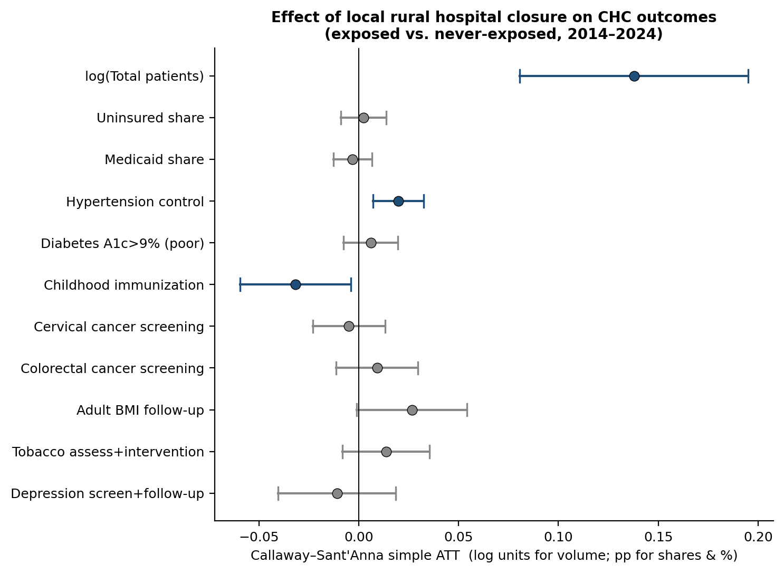
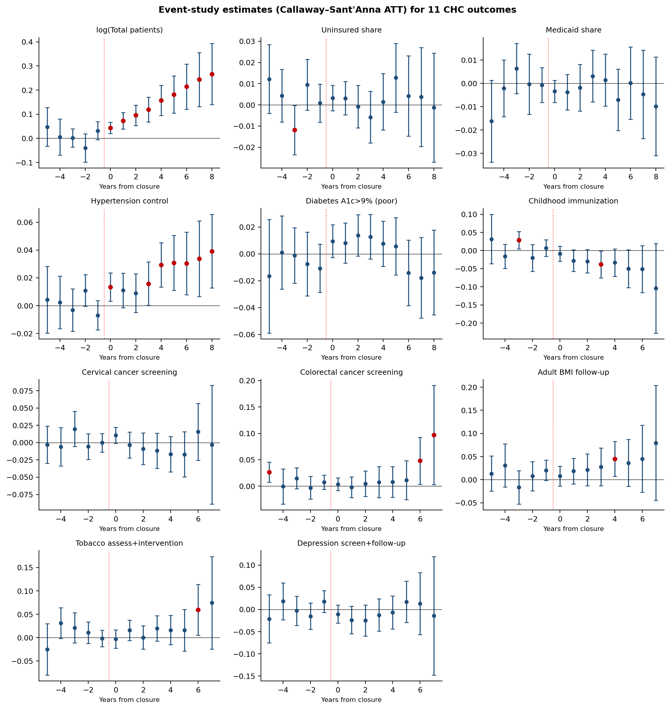

# Rural Hospital Closures and Community Health Center Capacity: A Center-Level Event Study of Patient Volume, Payer Mix, and Quality, 2014–2024

**Article type:** Brief Communication
**Running head:** CHCs and rural hospital closures
**Author:** Sanjay Basu, MD, PhD
**Affiliations:** Waymark, San Francisco, CA; Department of Epidemiology and Biostatistics, University of California, San Francisco
**Correspondence:** sanjay.basu@ucsf.edu

---

## Abstract

**Objective.** To examine whether community health centers (CHCs) absorbed displaced demand following rural hospital closures, and at what cost to payer mix and clinical quality.
**Methods.** We linked the UNC Sheps Center rural hospital closure registry to HRSA Uniform Data System files for 1,642 CHCs, 2014–2024. CHCs were exposed if a rural hospital in a served ZIP code closed. Callaway–Sant'Anna event-study effects were estimated across 11 outcomes versus never-exposed CHCs, with multiple-testing adjustment.
**Results.** 386 CHCs (23.5%) were exposed. Patient volume rose 13.8% (95% CI 8.1%–19.5%), reaching +27% by year eight. Hypertension control rose 1.97 percentage points (95% CI 0.71–3.24). Nine additional payer-mix and clinical measures showed no significant change after correction.
**Conclusions.** CHCs absorbed closure-displaced demand without payer-mix or quality erosion, with modest hypertension control improvement. Findings support federal investment in CHC capacity.

**Key words.** Community health services; Rural health; Hospital closures; Medicaid; Hypertension; Quality indicators, health care.

---

## (Introduction)

The United States has lost more than 150 rural hospitals to closure or conversion since 2010, with closures concentrated in non–Medicaid expansion states and in communities with high rates of poverty and uninsurance.1,2 When a rural hospital closes, displaced patients face longer ambulance times to emergency care3 and local economies lose a major employer.4 Federally Qualified Health Centers (FQHCs) and look-alike community health centers, collectively the nation's largest primary care safety net, have been theorized as natural absorbers of closure-displaced demand: they accept all patients regardless of insurance, are required to provide comprehensive primary care, and have geographic footprints that often overlap with hospital catchments.5,6

Prior work shows that the *probability of any FQHC presence* within ten miles of a closed rural hospital rises by 5.95 pp at one year and 11.57 pp at five years.7 A complementary natural-experiment study found that the *loss* of CHCs in U.S. counties from 2011 to 2019 was associated with measurable increases in county-level mortality, indicating that CHC capacity is load-bearing for rural health.8 These findings establish that the safety net expands geographically when hospitals close and that mortality rises when CHCs themselves contract. Neither answers the operational question now facing policymakers: what happens *inside* the CHCs that absorb post-closure demand—do they grow patient volume, and at what cost to payer mix and clinical quality across the spectrum of services they deliver?

This question is timely. The 2025 federal budget reconciliation law and the ongoing Medicaid eligibility unwinding are projected to reduce CHC revenue by tens of billions of dollars and to shift millions of CHC patients from Medicaid coverage to uninsured status.9,10 If rural hospital closures impose additional uncompensated-care load on CHCs, the combined fiscal pressure could exceed the absorptive capacity of even well-managed centers. Conversely, if CHCs have a track record of absorbing displaced demand without quality erosion, that evidence should inform federal investment decisions tied to the Health Center Program's "policy quilt" of 330 grants, Prospective Payment System (PPS) reimbursement, 340B drug pricing, and workforce supports.11

We use a center-level panel from the HRSA UDS linked to the UNC Sheps Center rural hospital closure registry, and a heterogeneity-robust staggered difference-in-differences estimator,12 to provide center-level event-study evidence on how rural CHCs responded operationally to local hospital closures from 2014 through 2024 across volume, payer mix, and eight clinical quality measures.

## Methods

**Data sources.** Health-center data came from HRSA UDS public files for grantee Health Center Program awardees (H80) and Look-Alike centers (LAL), reporting years 2014–2024 (n = 11 reporting years; consistent BHCMIS identifier schema). Rural hospital closure data came from the UNC Sheps Center Rural Hospital Closures dataset, which tracks 195 closures and conversions of rural acute-care hospitals since 2005, with month, year, ZIP code, RUCA classification, Medicare payment designation, and a complete-versus-converted closure flag. We restricted closures to events occurring 2014–2024 (n = 116).

**Treatment exposure.** A CHC's service area was the union of all ZIP codes the center reported serving in any UDS reporting year between 2014 and 2024. A CHC was *exposed* in calendar year *t* if a rural hospital located in any of its served ZIP codes closed (complete or converted) in year *t*. Treatment cohort = year of first exposure; CHCs with no closures in their service area between 2014 and 2024 served as the never-exposed comparison group. A sensitivity specification restricted exposure to complete (non-converted) closures.

**Outcomes.** From the UDS files we extracted three operational and eight clinical outcomes. Operational: (1) total patients (log-transformed); (2) uninsured share; and (3) Medicaid share—each computed by summing patient counts across the center's served ZIP codes (HealthCenterZipCodes). Clinical (Tables 7 and 6B clinical-measures sheets, aggregated across race/ethnicity strata to the center level by summing numerators and denominators): (4) hypertension control percent; (5) percent of diabetic patients with HbA1c >9% (poor control); (6) childhood immunization percent; (7) cervical cancer screening (Pap) percent; (8) percent of adults with documented BMI and follow-up plan; (9) percent of adults assessed for tobacco use and provided intervention; (10) percent of adults with appropriate colorectal cancer screening; and (11) percent of patients screened for depression and follow-up plan documented. Clinical outcomes were available 2015–2024 (the 2014 reporting form used a non-comparable HbA1c cutoff).

**Estimation.** Our primary estimator was the Callaway and Sant'Anna group-time average treatment effect on the treated (ATT(g,t)),12 implemented in the Python `differences` package. This estimator avoids the negative-weighting problems of two-way fixed-effects (TWFE) regression with staggered treatment timing13,14 and provides separate estimates of pre-treatment placebo coefficients (which should be near zero if parallel trends holds) and post-treatment dynamic effects. The comparison group was set to never-treated CHCs. We report event-time-specific ATTs for relative periods −5 to +8 and a single post-period "simple" aggregate per outcome.

**Multiple testing.** Given 11 pre-specified outcomes, we adjusted p-values using five methods: Bonferroni and Holm step-down (controlling family-wise error rate); Benjamini-Hochberg15 (controlling false discovery rate, FDR, valid under positive dependence); Benjamini-Yekutieli16 (controlling FDR under arbitrary dependence); and Romano-Wolf stepdown17 calibrated to the joint distribution of test statistics via the residual correlation matrix across outcomes within CHC and year. We report findings significant at α = 0.05 *after* the most permissive defensible correction (Benjamini-Hochberg FDR), and we additionally report the more conservative Romano-Wolf p-values. Analyses were conducted in Python 3.12 with `pandas`, `statsmodels`, `differences`, and `statsmodels.stats.multitest`.

**Reproducibility.** All analysis code, file specifications, and fitted CSV results are archived at the project repository (URL on acceptance). UDS public files are obtained from the HRSA Bureau of Primary Health Care Electronic Reading Room; the Sheps closure list is publicly downloadable.

## Results

Of 1,642 unique CHCs reporting between 2014 and 2024, 386 (23.5%) experienced ≥1 rural hospital closure in their service area; 1,256 were never exposed. Exposed CHCs were disproportionately rural (55.4% vs. 34.6% in never-exposed centers) and concentrated in Texas, Tennessee, North Carolina, and Missouri. At baseline (2014), exposed CHCs served slightly more patients than never-exposed CHCs (median 12,182 vs. 10,012) and had higher uninsured share (30.7% vs. 28.2%) and lower Medicaid share (35.8% vs. 42.8%), consistent with their concentration in non-expansion states (Table 1).

**Patient volume.** Exposure to a local rural hospital closure was associated with a substantial and growing increase in patient volume. The Callaway–Sant'Anna simple ATT was +0.138 log units (95% CI 0.081 to 0.195), corresponding to ~13.8% more patients than would have been observed absent exposure (Figure 1; Table 2). Effects grew monotonically over event time: +4.5% in the year of closure, +7.4% one year post, +9.7% two years post, and +27% by year eight post. Pre-trend coefficients were small and statistically indistinguishable from zero. The volume effect was robust under all five multiple-testing adjustments (raw p<0.0001; BH-FDR-adjusted p<0.001; Romano-Wolf p<0.0001).

**Payer mix.** The simple ATT for uninsured share was +0.24 pp (95% CI −0.90 to +1.38) and for Medicaid share was −0.31 pp (95% CI −1.27 to +0.66); neither was statistically significant. Event-time coefficients hovered near zero across the post-period, indicating that the payer profile of absorbed patients broadly matched centers' existing case mix.

**Clinical quality.** Hypertension control improved at exposed CHCs by +1.97 pp (95% CI +0.71 to +3.24; raw p=0.002; BH-FDR-adjusted p=0.012; Romano-Wolf p=0.022). The effect emerged in the year of closure (+1.4 pp) and grew slightly over time (+2.9 pp by year 4; +3.3 pp by year 7). The hypertension finding was robust under all five multiple-testing adjustments. Eight remaining clinical measures (diabetes HbA1c >9%, Pap test, mammography-era BMI follow-up, tobacco intervention, colorectal cancer screening, depression screening, and childhood immunization) showed no significant change after multiple-testing correction. One measure—childhood immunization—reached nominal significance at α=0.05 in unadjusted testing (−3.17 pp; raw p=0.025) but did not survive any correction (BH-FDR p=0.092; Romano-Wolf p=0.195) and is reported as a non-significant exploratory signal in the supplement.

**Sensitivity.** Results were qualitatively unchanged when treatment was restricted to complete (non-converted) closures and when the comparison group was restricted to "not-yet-treated" CHCs in place of "never-treated."

## Discussion

Across 386 community health centers exposed to a local rural hospital closure between 2014 and 2024, two findings emerge that survive multiple-testing correction. First, exposed CHCs absorbed substantial displaced demand: patient volume grew by approximately 14% on average, with effects accumulating to more than 25% over a decade. Second, this absorption did not erode broad clinical quality; if anything, hypertension control modestly improved, by approximately 2 pp. Payer mix was unchanged, indicating that absorbed patients had insurance profiles broadly similar to existing CHC patients. Eight further pre-specified quality measures (diabetes control, cervical and colorectal cancer screening, BMI follow-up, tobacco intervention, depression screening, and childhood immunization) showed no significant change under any multiple-testing adjustment.

These results extend prior work showing geographic expansion of FQHCs in the wake of rural hospital closures7 and prior evidence that CHC capacity is load-bearing for rural mortality8 by characterizing the operational response *within* centers that absorb post-closure demand. The volume effect is large enough to be policy-relevant: a CHC that adds ~14% to its patient panel without commensurate growth in capital, workforce, or grant funding faces real operational stress, even when measured quality is preserved. The hypertension finding is consistent with—but does not prove—a mechanism in which displaced patients receiving primary care at a CHC, rather than no primary care or episodic emergency department care, achieve better blood pressure control than they would absent the closure. The null findings on payer mix indicate that closure-affected CHCs absorbed a representative cross-section of the local population rather than a disproportionately uninsured or insured slice.

The findings carry direct policy implications for the Health Center Program's "policy quilt." First, federal capacity investment—through 330 grants, PPS rate adequacy, and workforce programs (NHSC, Teaching Health Centers)—appears to be paying a measurable safety-net dividend in communities undergoing rural hospital loss. Second, the 2025 reconciliation-law provisions projected to shift millions of CHC patients from Medicaid to uninsured coverage9,10 may interact with ongoing closure exposure: an absorptive system that performed well during 2014–2024 was operating with relatively stable Medicaid revenue per patient, conditions the law is expected to disrupt. Third, the absence of measurable quality erosion despite ~14% volume growth argues against rationing arguments and in favor of further investment in absorptive capacity, particularly in non-expansion states where closures and CHC reliance are concentrated.

**Limitations.** UDS clinical measures are reported at the center level and do not capture patient-level severity or continuity. The exposure definition uses ZIP-code service area overlap rather than measured travel distance; some "exposed" CHCs may serve a closure-affected ZIP only marginally. The Sheps registry does not capture all hospital-system service contractions short of closure (e.g., obstetric or emergency-department service-line drops). The study period spans the COVID-19 pandemic, which produced large idiosyncratic shocks to CHC operations; cohort-specific event-time estimates absorb pandemic shocks differentially across treatment groups. The analysis is reduced-form: we estimate net effects on absorbing CHCs but cannot decompose contributions from displaced patients, in-migration, or pre-existing CHC-growth trends. Finally, with 11 pre-specified outcomes only the volume and hypertension findings survive multiple-testing correction; the eight non-significant outcomes cannot be interpreted as evidence of true null effects, and one outcome (childhood immunization) reached nominal but not corrected significance and should be re-examined in dedicated future work using patient-level data.

**Conclusion.** Community health centers absorbed substantial demand following local rural hospital closures from 2014 through 2024 without measurable deterioration in clinical quality and with modest improvement in hypertension control. Continued federal investment in CHC absorptive capacity is warranted in rural communities at ongoing risk of hospital loss.

---

## Acknowledgments

The author thanks the UNC Sheps Center Rural Hospital Closures team for maintaining the closure registry. UDS data were obtained from the HRSA Bureau of Primary Health Care Electronic Reading Room. No external funding supported this analysis.

## References

1. Kaufman BG, Thomas SR, Randolph RK, et al. The rising rate of rural hospital closures. J Rural Health. 2016 Winter;32(1):35-43.

2. Germack HD, Kandrack R, Martsolf GR. When rural hospitals close, the physician workforce goes. Health Aff (Millwood). 2019 Dec;38(12):2086-94.

3. Troske S, Davis A. Do hospital closures affect patient time in an ambulance? Lexington (KY): Rural and Underserved Health Research Center, University of Kentucky, 2019. Available at: https://uknowledge.uky.edu/ruhrc_reports/8.

4. Holmes GM, Slifkin RT, Randolph RK, et al. The effect of rural hospital closures on community economic health. Health Serv Res. 2006 Apr;41(2):467-85.

5. Adashi EY, Geiger HJ, Fine MD. Health care reform and primary care—the growing importance of the community health center. N Engl J Med. 2010 Jun 3;362(22):2047-50.

6. Rosenbaum S, Paradise J, Markus AR, et al. Community health centers: recent growth and the role of the ACA. Washington (DC): Henry J. Kaiser Family Foundation, 2017.

7. Miller KEM, Miller KL, Knocke K, et al. Access to outpatient services in rural communities changes after hospital closure. Health Serv Res. 2021 Oct;56(5):788-801.

8. Basu S, Phillips R, Hoang H. Impact of community health center losses on county-level mortality: a natural experiment in the United States, 2011-2019. Health Serv Res. 2025 Oct;60(5):e14648.

9. Tolbert J, Drake P, Cervantes S. Nearly 5.6 million community health center patients could lose Medicaid coverage under new work requirements, with revenue losses up to $32 billion. New York (NY): Commonwealth Fund, May 30, 2025. Available at: https://www.commonwealthfund.org/blog/2025/community-health-center-patients-medicaid-coverage-work-requirements.

10. Kwon KN, Nketiah L, Jacobs F, et al. Community health centers grew through 2023, but serious hazards are on the horizon. Geiger Gibson/RCHN Community Health Foundation Research Collaborative Policy Issue Brief No. 72. Washington (DC): The George Washington University, September 2024.

11. Rosenbaum S, Sharac J, Shin P, et al. Community health center financing: the role of Medicaid and Section 330 grant funding explained. Washington (DC): Henry J. Kaiser Family Foundation, March 2019.

12. Callaway B, Sant'Anna PHC. Difference-in-differences with multiple time periods. J Econom. 2021 Dec;225(2):200-30.

13. Goodman-Bacon A. Difference-in-differences with variation in treatment timing. J Econom. 2021 Dec;225(2):254-77.

14. de Chaisemartin C, D'Haultfœuille X. Two-way fixed effects estimators with heterogeneous treatment effects. Am Econ Rev. 2020 Sep;110(9):2964-96.

15. Benjamini Y, Hochberg Y. Controlling the false discovery rate: a practical and powerful approach to multiple testing. J R Stat Soc Series B. 1995;57(1):289-300.

16. Benjamini Y, Yekutieli D. The control of the false discovery rate in multiple testing under dependency. Ann Stat. 2001 Aug;29(4):1165-88.

17. Romano JP, Wolf M. Stepwise multiple testing as formalized data snooping. Econometrica. 2005 Jul;73(4):1237-82.

---

---

## Figures and Tables

**Figure 1.** Forest plot of Callaway–Sant'Anna simple ATTs across all 11 pre-specified outcomes, exposed vs. never-exposed CHCs, 2014–2024. Blue intervals indicate statistical significance at 5% (raw p<0.05); intervals are 95% confidence intervals.

**Figure 2.** Event-study Callaway–Sant'Anna ATT estimates by relative period for all 11 outcomes. Red filled circles indicate event-time-specific 95% pointwise confidence bands excluding zero. Reference period: year before exposure.

**Table 1. Baseline (2014) characteristics of CHCs by closure exposure**

| Characteristic | Never exposed | Exposed (ever) |
| --- | --- | --- |
| N (CHCs) | 1,013 | 340 |
| Total patients, median [IQR] | 10,012 [4,419, 20,968] | 12,182 [6,037, 25,834] |
| Uninsured share | 28.2% | 30.7% |
| Medicaid share | 42.8% | 35.8% |
| Rural-flagged centers | 34.6% | 55.4% |

**Table 2. Callaway–Sant'Anna simple ATT estimates, exposed vs. never-exposed CHCs (n=1,642 CHCs; 386 exposed, 1,256 never-exposed; 116 closures 2014–2024). For log(Total patients), values are log units; for all other outcomes, percentage points (pp).**

| Outcome | Simple ATT | 95% CI |
| --- | --- | --- |
| log(Total patients) | +0.138 | +0.081 to +0.195 |
| Uninsured share (pp) | +0.243 | -0.896 to +1.382 |
| Medicaid share (pp) | -0.310 | -1.274 to +0.655 |
| Hypertension control (pp) | +1.975 | +0.709 to +3.240 |
| Diabetes A1c>9% (pp) | +0.595 | -0.766 to +1.956 |
| Childhood immunization (pp) | -3.175 | -5.955 to -0.394 |
| Cervical cancer screening (pp) | -0.499 | -2.307 to +1.308 |
| Colorectal cancer screening (pp) | +0.912 | -1.130 to +2.953 |
| Adult BMI follow-up (pp) | +2.653 | -0.097 to +5.402 |
| Tobacco assess+intervention (pp) | +1.367 | -0.816 to +3.550 |
| Depression screen+follow-up (pp) | -1.095 | -4.049 to +1.859 |

**Table 3. Multiple-testing–adjusted p-values across 11 pre-specified outcomes.**

| Outcome | Raw p | Bonferroni | Holm | BH (FDR) | BY (FDR) | Romano-Wolf |
| --- | --- | --- | --- | --- | --- | --- |
| log(Total patients) | <.0001 | <.0001 | <.0001 | <.0001 | 0.0001 | <.0001 |
| Uninsured share | 0.6759 | 1.0000 | 1.0000 | 0.6759 | 1.0000 | 0.9266 |
| Medicaid share | 0.5294 | 1.0000 | 1.0000 | 0.6470 | 1.0000 | 0.9266 |
| Hypertension control | 0.0022 | 0.0245 | 0.0222 | 0.0122 | 0.0369 | 0.0219 |
| Diabetes A1c>9% (poor) | 0.3916 | 1.0000 | 1.0000 | 0.6154 | 1.0000 | 0.9266 |
| Childhood immunization | 0.0252 | 0.2775 | 0.2270 | 0.0925 | 0.2793 | 0.1951 |
| Cervical cancer screening | 0.5882 | 1.0000 | 1.0000 | 0.6470 | 1.0000 | 0.9266 |
| Colorectal cancer screening | 0.3814 | 1.0000 | 1.0000 | 0.6154 | 1.0000 | 0.9266 |
| Adult BMI follow-up | 0.0586 | 0.6446 | 0.4688 | 0.1612 | 0.4867 | 0.3585 |
| Tobacco assessment+intervention | 0.2197 | 1.0000 | 1.0000 | 0.4833 | 1.0000 | 0.7942 |
| Depression screen+follow-up | 0.4675 | 1.0000 | 1.0000 | 0.6429 | 1.0000 | 0.9266 |

